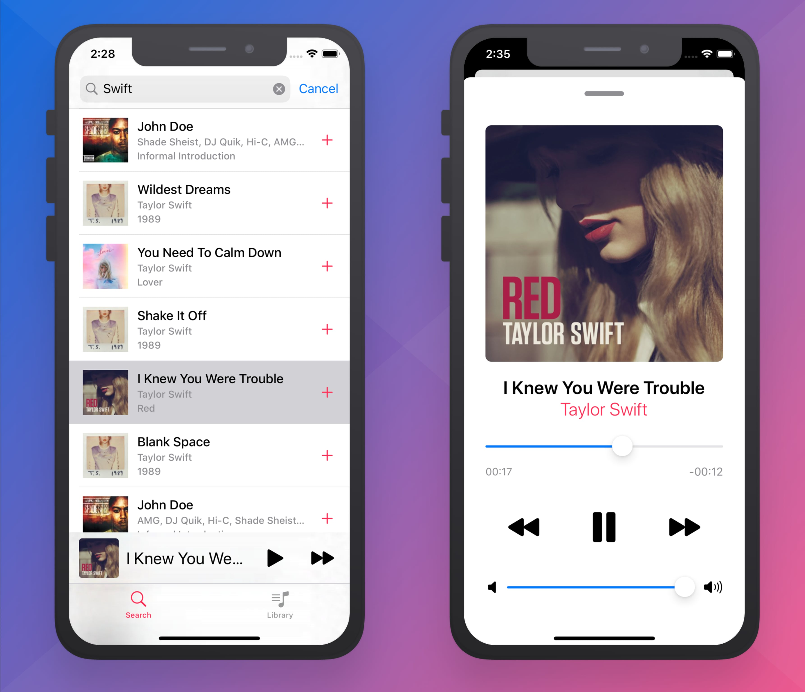
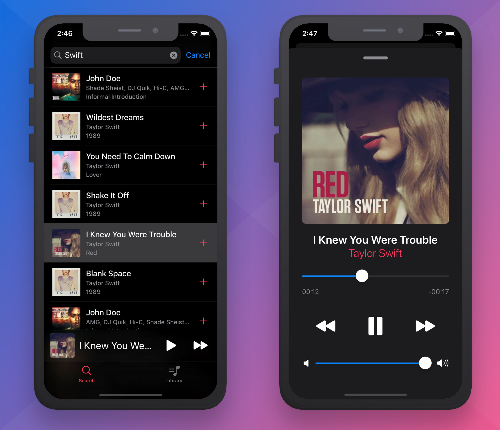
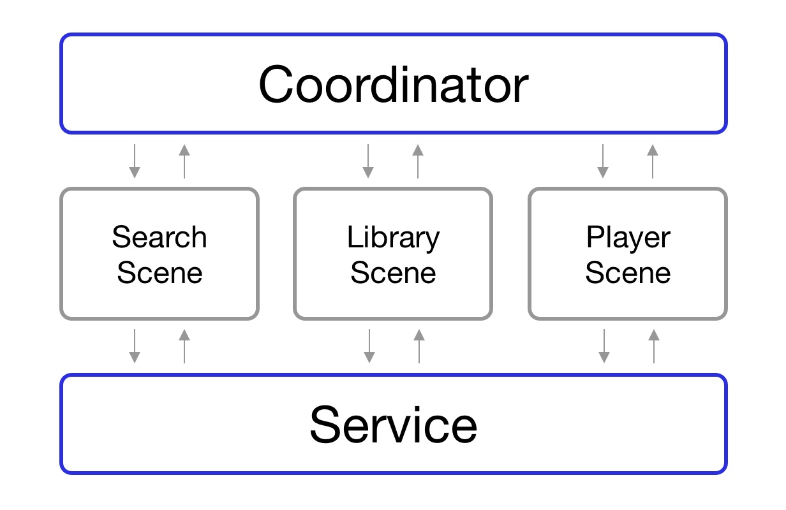

## Music App Demo
Приложение для доступа к музыкальному контенту, предоставляемому сервисом iTunes Search API. Позволяет искать preview треков в сервисе Apple Music, прослушивать полученные треки, а также сохранять понравившиеся композиции в библиотеке.

### Архитектура
Проект разработан с применением архитектурных подходов Clean Swift и Coordinator. В основе каждого экрана(сцены) лежит VIP цикл (View - Interactor - Presenter). Для обмена данными и передачи событий между экранами применятся координатор. За работу с сетевыми запросами, базой данных, воспроизведением аудио отвечает сервисный слой.

### О проекте

- В качестве View в VIP цикле выступает ViewController, при этом весь код, связанный с созданием и настройкой UI элементов вынесен из ViewController в UIView  subclass. Данный подход позволяет дополнительно разгрузить Massive ViewController, а также позволяет переиспользовать View в нескольких экранах;
- Интерфейс создан без использования Storyboard. В зависимости от экрана, интерфейс создан с помощью XIB файлов или программным способом;
- Приложение поддерживает новую функцию iOS 13 – темную тему (Dark Mode);
- Приложение поддерживает локализацию, интерфейс доступен на русском и английском языке;
- Для воспроизведения аудио используется AVFoundation;
- Для сохранения понравившихся треков в библиотеку используется CoreData;
- В приложении реализована анимация перехода между различными вариантами отображения плеера, имитирующая анимацию перехода приложения Apple Music;
- Приложение поддерживает функцию локализации. Доступны интерфейсы на английском и русском языке;
- Для автоматической проверки кода на соблюдение code style применяется утилита SwiftLint от Realm.

### Демо

